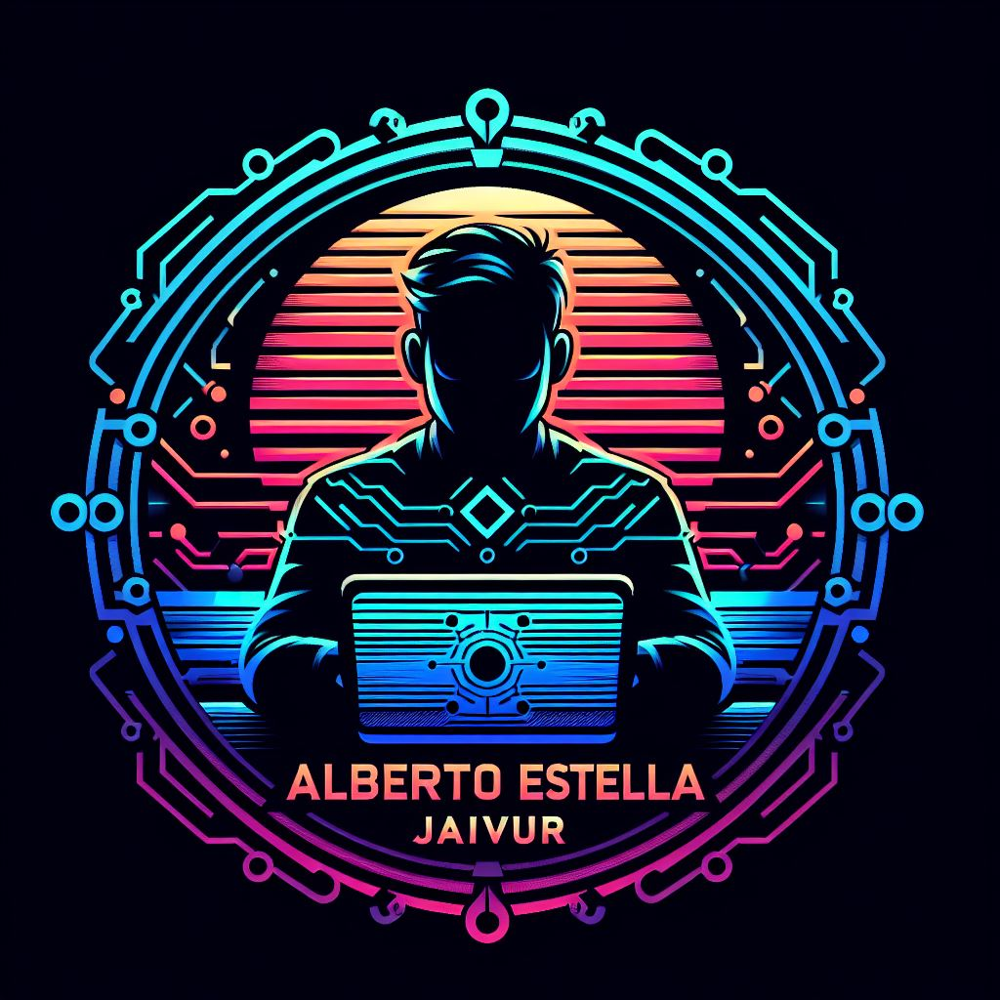

# ***Alberto Estella Quel***  

## *Repositorio principal*
### *Bienbenido.*
- 👋 Hola mi nombre es Alberto, @Jalivur
- 👀 Estoy muy interesado en aprender y mejorar mis conociminetos de programacion, junto a la cominidad de GitHub
- 🌱 Actualmente estoy aprendiendo:
  # ***Python*** 
  
  # ***Git***  
  
  # ***GitHub***  
  
  # ***VSCode*** 
  - y muchas cosas entortno a la programacion de alto nivel.

<!---
Jalivur/Jalivur is a ✨ special ✨ repository because its `README.md` (this file) appears on your GitHub profile.
You can click the Preview link to take a look at your changes.
--->
